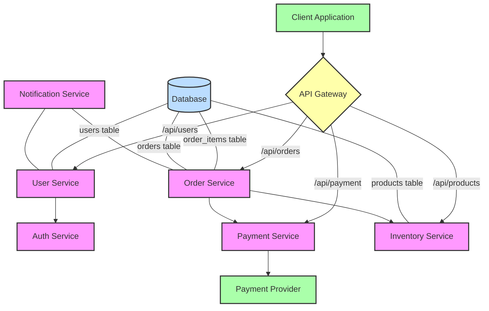

## MCP Example: System Architecture Diagram Generation

### Model-Context-Protocol for Architecture Visualization

Model-Context-Protocol (MCP) provides powerful capabilities for generating system architecture diagrams by connecting AI models to relevant data sources and specialized tools. This approach is particularly valuable when visualizing complex systems with many components and relationships.

### How MCP Enhances Architecture Diagram Creation

* **Database Schema Access:** MCP can directly query database schemas to understand table relationships and data structures.
* **Code Repository Analysis:** Connect to version control systems to analyze actual implementation details.
* **API Documentation Integration:** Pull information from API documentation to understand service interfaces.
* **Infrastructure-as-Code Parsing:** Extract architecture details from Terraform, CloudFormation, or other IaC files.
* **Diagram Rendering:** Use specialized tools to render the generated diagram in formats like SVG or PNG.

### Example Workflow

1. **Data Collection:** MCP connects to relevant sources (databases, repositories, documentation)
2. **Information Synthesis:** The AI model processes and organizes the collected information
3. **Diagram Generation:** The model produces a diagram in a format like Mermaid or PlantUML
4. **Rendering:** The diagram code is processed by appropriate tools to create visual output

### Example Scenario

Imagine we need to visualize the architecture of an e-commerce system. With MCP, we can:

1. Query the database to understand data relationships
2. Analyze API endpoints to map service interactions
3. Generate a comprehensive architecture diagram

**Example Input Context:**

```text
# Database Schema (from SQL query)
Tables:
- users (id, name, email, password_hash)
- products (id, name, description, price, category_id)
- orders (id, user_id, status, created_at)
- order_items (id, order_id, product_id, quantity, price)

# API Endpoints (from API documentation)
- /api/users - User management
- /api/products - Product catalog
- /api/orders - Order processing
- /api/payment - Payment processing

# Service Dependencies (from configuration files)
- UserService depends on AuthService
- OrderService depends on PaymentService, InventoryService
- NotificationService used by OrderService, UserService
```

**Example Prompt:**

```
Using the database schema, API endpoints, and service dependencies provided, generate a system architecture diagram in Mermaid syntax. The diagram should:

1. Show all services and their relationships
2. Indicate the database tables used by each service
3. Display API endpoints for each service
4. Use appropriate shapes for different component types (database, service, external system)
5. Organize the diagram for readability with logical grouping
```

**Example Output (Mermaid Syntax):**



### Benefits of MCP for Architecture Diagramming

* **Accuracy:** Diagrams based on actual system data rather than manual interpretation
* **Consistency:** Standardized representation of system components
* **Maintainability:** Easily regenerate diagrams as systems evolve
* **Integration:** Connect with documentation systems and DevOps pipelines
* **Collaboration:** Provide clear visualizations to facilitate team discussions
